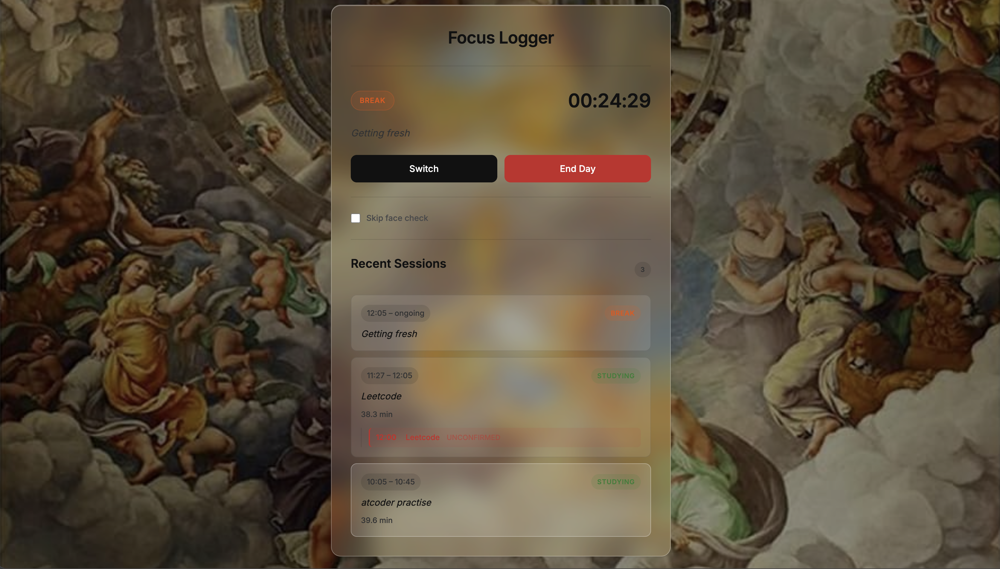

# Focus Logger
Personal local web app to log study/break sessions with timestamps, including periodic adherence check-ins during a session.
## Screenshot

## Features
- **Face check-in**: Webcam-based face presence detection (no recognition, no storage)
- **Session tracking**: Log study/break sessions with timestamps and notes
- **Periodic check-ins**: Non-blocking prompts every ~22 minutes to confirm or update current activity
- **System notifications**: macOS notifications appear even when you're in other apps (VS Code, browser, etc.)
- **Skip face check**: Manual override for Switch/End Day
- **Local storage**: All data stored in local Excel file (`focus_log.xlsx`)
- **No cloud, no auth**: Runs entirely on localhost
- **Privacy-first**: No images stored — frames discarded immediately after detection
## Stack
- Backend: Python, FastAPI
- Frontend: Vanilla HTML/JS served by FastAPI
- Data: Excel via openpyxl
- Face detection: OpenCV Haar cascade
- Notifications: Browser Notification API
## Quick Start
```bash
# Install dependencies
pip install -r requirements.txt
# Run the server
./run.sh
# Or: cd app && python main.py
```
Then open **http://localhost:8000** in your browser.
## Usage
1. Click **"Clock In"** — browser requests camera access (allow it)
2. Position your face in the frame — face detection runs locally
3. Select **Studying** or **Break** and add a note
4. Click **Start Session** — timer begins
5. Every ~22 minutes, a check-in appears:
   - **In-page popup** (if Focus Logger tab is open)
   - **macOS notification** (top-right, works in any app)
   - **Yes** — confirm current activity
   - **Update Note** — change the note (e.g., "drifted to YouTube")
6. Click **Switch** to change between Study/Break (requires face check)
7. Click **End Day** to close the final session
8. **Skip face check** checkbox — bypass webcam for Switch/End Day
## Configuration
Edit `.env` to customize:
```env
CHECKIN_INTERVAL_MIN=30    # Check-in frequency (minutes)
EXCEL_FILE=focus_log.xlsx  # Data file location
HOST=localhost
PORT=8000
```
## Data Model
### Sessions sheet
| Column | Type | Notes |
|--------|------|-------|
| session_id | int | auto-increment |
| date | date | |
| start_time | datetime | |
| end_time | datetime | nullable until closed |
| duration_min | float | computed on close |
| type | string | "Studying" / "Break" |
| note | string | free text |
### Checkins sheet
| Column | Type | Notes |
|--------|------|-------|
| checkin_id | int | auto-increment |
| session_id | int | FK to session |
| timestamp | datetime | |
| status | string | "confirmed" / "updated" / "unconfirmed" |
| note | string | current note at check-in |
## API Endpoints
- `POST /clock-in` — Face detection (body: base64 frame)
- `POST /session/start` — Start new session (closes open one)
- `POST /session/checkin` — Log a check-in
- `POST /session/end-day` — Close current session
- `GET /sessions/today` — Today's sessions
- `GET /session/current` — Current open session
- `GET /checkin/interval` — Check-in interval config
- `GET /session/{id}/checkins` — Check-ins for a session